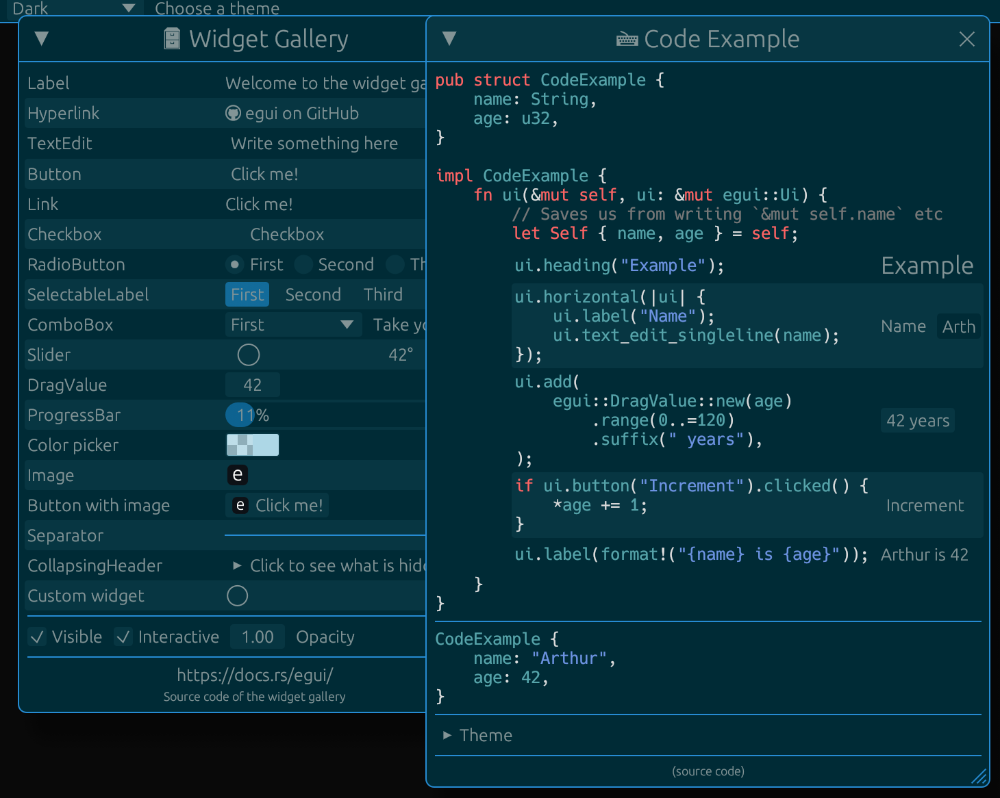
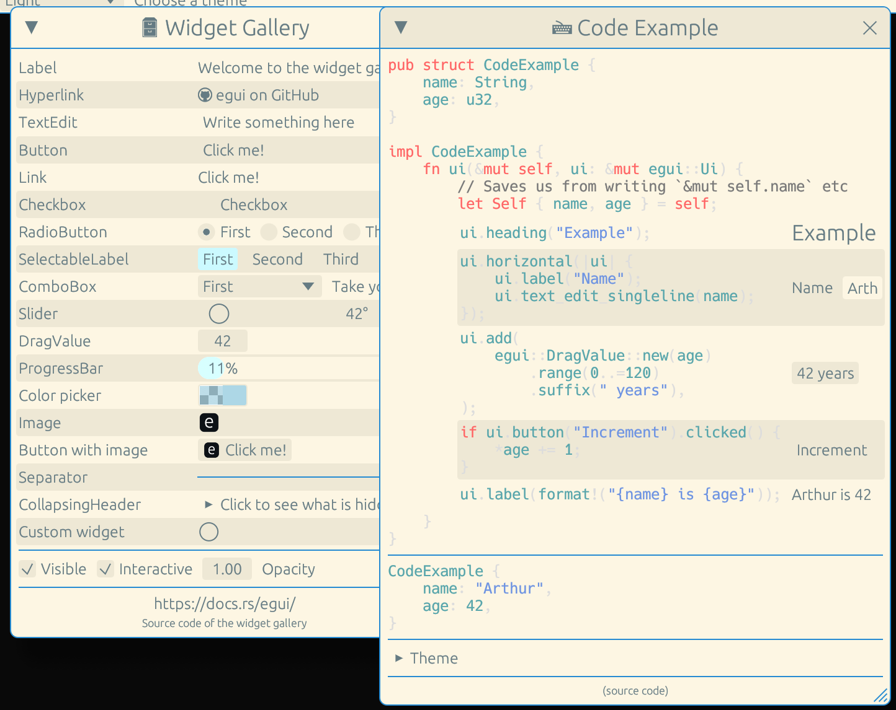

# egui-solarized

## Description

This crate is a port of [solarized](https://ethanschoonover.com/solarized) theme
to [egui](https://github.com/emilk/egui)
There is a dark and a light theme.
You can use them with egui by calling `ctx.set_visuals(Theme::solarized_dark().into())` or
`ctx.set_visuals(Theme::solarized_light().into())`

## Howto

Add the following to your `Cargo.toml`:

```toml
[dependencies]
egui_solarized = "0.1.0"
```

Then add the following to your `main.rs`:

```rust
use egui_solarized::solarized;

fn main() {
    eframe::run_native(
        "egui demo app",
        options,
        Box::new(|ctx| {
            /// Install egui's default image loaders to open image files from the file system.
            ctx.egui_ctx.set_visuals(Theme::solarized_dark().into());
            Ok(Box::new(DemoApp::default()))
        }),
    )
}
```

### Showcase

You can find a demo in the examples/demo folder.
Basically I "stole" the widget gallery of the egui crate to demonstrate solarized theme on it

## Dark Mode


## Light Mode
